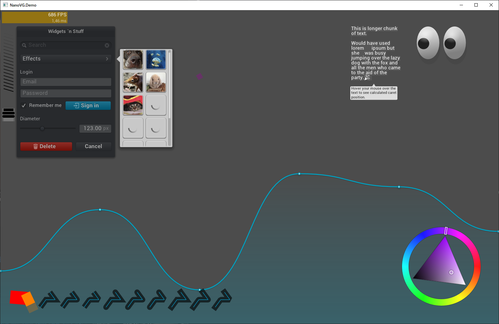

# NanoVG.Bindings
NanoVG API bindings for .NET

[Demo for Windows Platform x64 (.NET Framework 4.8 required)](./NanoVG.Demo.NetFx)
[Demo project description](./NanoVG.Demo)

### TODO:
+ [x] Basic API bindings
+ [x] Demo ported to .NET with NanoVG.Bindings API usage
+ [x] Demo is tested and running on Windows
+ [ ] Demo is tested and running on Linux (NOT CONFIRMED but should working, requires create a new Project that wrapped NanoVG.Demo for linux) 
+ [ ] Confirm all API bindings is working
+ [ ] NanoVG software rasteriser API support